<div align="center" id="trendradar">

<a href="https://github.com/sansan0/TrendRadar" title="TrendRadar">
  
</a>

🚀 Hotspot assistant deployed in fastest <strong>30 seconds</strong> — Say goodbye to ineffective scrolling, only see the news and information you truly care about

[](https://github.com/sansan0/TrendRadar/stargazers)
[](https://github.com/sansan0/TrendRadar/network/members)
[](LICENSE)
[](https://github.com/sansan0/TrendRadar)
[](https://github.com/sansan0/TrendRadar)

[](https://work.weixin.qq.com/)
[](https://telegram.org/)
[](#)
[](https://www.feishu.cn/)
[](#) 
[](https://github.com/binwiederhier/ntfy)
</div>


> This project aims to be lightweight and easy to deploy

## 📑 Quick Navigation

<div align="center">

| [🎯 Core Features](#-core-features) | [🚀 Quick Start](#-quick-start) | [🐳 Docker Deployment](#-docker-deployment) | [🤖 AI Analysis Zone](#-ai-intelligent-analysis-deployment) |
|:---:|:---:|:---:|:---:|
| [📝 Changelog](#-changelog) | [🔌 MCP Client](#-mcp-client) | [❓ Q&A and FAQ](#questions-and-answers) | [⭐ Project Related](#project-related) |

</div>

- Thanks to **contributors who patiently report bugs**, your every feedback makes the project better😉;  
- Thanks to **viewers who star the project**, **fork** what you want, **star** what I want, both can be had😍is the best support for the open source spirit;  
- Thanks to **readers who follow the [official account](#questions-and-answers)**, your active interactions such as comments, likes, shares and recommendations make the content more warm😎.

## ✨ Core Features

### **All-Platform Hotspot Aggregation**

- Zhihu
- Douyin
- Bilibili Hot Search
- Wall Street News
- Tieba
- Baidu Hot Search
- Cailian Press Hot
- Thepaper News
- Phoenix News
- Toutiao
- Weibo

Monitor 11 mainstream platforms by default, you can also add extra platforms yourself

<details>
<summary><strong>👉 Custom Monitoring Platforms</strong></summary>
<br>

The information data of this project comes from [newsnow](https://github.com/ourongxing/newsnow), you can click [website](https://newsnow.busiyi.world/), click [More] to see if there is the platform you want. 

For specific additions, visit [project source code](https://github.com/ourongxing/newsnow/tree/main/server/sources), according to the file names, modify the `platforms` configuration in the `config/config.yaml` file:

```yaml
platforms:
  - id: "toutiao"
    name: "Toutiao"
  - id: "baidu"  
    name: "Baidu Hot Search"
  - id: "wallstreetcn-hot"
    name: "Wall Street News"
  # Add more platforms...
```
If you don't know how to look, just copy the partially organized [platform configuration](https://github.com/sansan0/TrendRadar/issues/95) by others

</details>

### **Smart Push Strategy**

**Three push modes**:

| Mode | Target Audience | Push Timing | Display Content | Application Scenarios |
|------|----------|----------|----------|----------|
| **Daily Summary**<br/>`daily` | 📋 Enterprise managers/General users | Timed push (default once per hour) | All matching news of the day<br/>+ New news area | Daily summary<br/>Comprehensive understanding of daily hot trends |
| **Current Ranking**<br/>`current` | 📰 Media creators/Content creators | Timed push (default once per hour) | Current ranking matching news<br/>+ New news area | Real-time hot tracking<br/>Understand the current hottest content |
| **Incremental Monitoring**<br/>`incremental` | 📈 Investors/Traders | Push only when there's new content | Newly appeared matching frequency word news | Avoid repeated information interference<br/>High-frequency monitoring scenarios |

**Additional Feature - Push Time Window Control** (Optional):

This feature is independent of the above three push modes and can be used in combination with any mode:

- **Time Window Limitation**: Set push time range (e.g. 09:00-18:00 or 20:00-22:00), only push within specified time
- **Push Frequency Control**:
  - Multiple pushes within window: Push every execution within time window
  - Push only once per day: Push only once within time window (suitable for daily summary or current ranking mode)
- **Typical Scenarios**:
  - Work time push: Only receive messages during work hours 09:00-18:00
  - Evening summary push: Want to receive summary at fixed time in the evening (e.g. 20:00-22:00)
  - Avoid disturbance: Prevent receiving push notifications during non-work hours

> Tip: This feature is disabled by default, needs to be manually enabled in `config/config.yaml` with `push_window.enabled`

### **Precise Content Filtering**

Set personal keywords (such as: AI, BYD, education policy), only push related hotspots, filter irrelevant information

- Supports three grammars: ordinary words, required words (+), and filter words (!), see [frequency_words.txt Configuration Tutorial]
- Group management, independent statistics of different theme hotspots

> You can also skip filtering and push all hotspots completely, see v2.0.1 in [Historical Updates] for details

<details>
<summary><strong>👉 frequency_words.txt Configuration Tutorial</strong></summary>
<br>

Configure monitoring keywords in the `frequency_words.txt` file, supports three grammars and group functions.

The earlier the keyword, the higher the news priority, you can adjust the keyword order according to your attention level

| Grammar Type | Symbol | Function | Example | Matching Logic |
|---------|------|------|------|---------|
| **Ordinary Words** | None | Basic matching | `Huawei` | Containing any one is sufficient |
| **Required Words** | `+` | Scope limitation | `+phone` | Must contain simultaneously |
| **Filter Words** | `!` | Eliminate interference | `!ad` | Directly excluded if contained |

### 📋 Basic Grammar Explanation

#### 1. **Ordinary Keywords** - Basic Matching
```txt
Huawei
OPPO
Apple
```
**Function:** News titles containing **any one of these words** will be captured

#### 2. **Required Words** `+word` - Scope Limitation  
```txt
Huawei
OPPO
+phone
```
**Function:** Must contain both ordinary words **and** required words to be captured

#### 3. **Filter Words** `!word` - Eliminate Interference
```txt
Apple
Huawei
!fruit
!price
```
**Function:** News containing filter words will be **directly excluded**, even if they contain keywords

### 🔗 Group Function - The Important Role of Blank Line Separation

**Core Rule:** Use **blank lines** to separate different groups, each group is counted independently

#### Example Configuration:
```txt
iPhone
Huawei
OPPO
+release

A-shares
Shanghai Composite
Shenzhen Component
+ups and downs
!prediction

World Cup
European Championship
Asian Cup
+match
```

#### Group Explanation and Matching Effect:

**Group 1 - New Phone Products:**
- Keywords: iPhone, Huawei, OPPO
- Required word: release
- Effect: Must contain phone brand name and "release" simultaneously

**Matching Examples:**
- ✅ "iPhone 15 officially released with price announcement" ← Contains "iPhone"+"release"
- ✅ "Huawei Mate60 series release live broadcast" ← Contains "Huawei"+"release"
- ✅ "OPPO Find X7 release time confirmed" ← Contains "OPPO"+"release"
- ❌ "iPhone sales hit record high" ← Contains "iPhone" but lacks "release"

**Group 2 - Stock Market Trends:**  
- Keywords: A-shares, Shanghai Composite, Shenzhen Component
- Required word: ups and downs
- Filter words: prediction
- Effect: Contains stock market related words, simultaneously contains "ups and downs", but excludes content containing "prediction"

**Matching Examples:**
- ✅ "A-shares today's significant ups and downs analysis" ← Contains "A-shares"+"ups and downs"
- ✅ "Shanghai Composite index ups and downs reason interpretation" ← Contains "Shanghai Composite"+"ups and downs"
- ❌ "Experts predict A-shares ups and downs trend" ← Contains "A-shares"+"ups and downs" but contains "prediction"
- ❌ "A-shares trading volume hits record high" ← Contains "A-shares" but lacks "ups and downs"

**Group 3 - Football Matches:**
- Keywords: World Cup, European Championship, Asian Cup
- Required word: match
- Effect: Must contain cup competition name and "match" simultaneously

**Matching Examples:**
- ✅ "World Cup group stage match results" ← Contains "World Cup"+"match"
- ✅ "European Championship final match time" ← Contains "European Championship"+"match"
- ❌ "World Cup tickets on sale" ← Contains "World Cup" but lacks "match"

### 🎯 Configuration Tips

#### 1. **From Broad to Strict Configuration Strategy**
```txt
# Step 1: First test with broad keywords
Artificial Intelligence
AI
ChatGPT

# Step 2: After discovering mismatches, add required words for limitation
Artificial Intelligence  
AI
ChatGPT
+technology

# Step 3: After discovering interfering content, add filter words
Artificial Intelligence
AI  
ChatGPT
+technology
!ad
!training
```

#### 2. **Avoid Over-Complexity**
❌ **Not Recommended:** One group contains too many words
```txt
Huawei
OPPO
Apple
Samsung
vivo
OnePlus
Meizu
+phone
+release
+sales
!fake
!repair
!second-hand
```

✅ **Recommended:** Split into multiple precise groups
```txt
Huawei
OPPO
+new product

Apple
Samsung  
+release

phone
sales
+market
```

</details>


### **Hotspot Trend Analysis**

Track news popularity changes in real-time, so you not only know "what's trending" but also understand "how hotspots evolve"

- **Timeline Tracking**: Record the complete time span of each news from first appearance to last appearance
- **Popularity Changes**: Statistics of news ranking changes and frequency in different time periods  
- **New Detection**: Real-time identification of newly emerging hot topics, marked with 🆕 for immediate notification
- **Continuity Analysis**: Distinguish between one-time hot topics and continuously developing in-depth news
- **Cross-Platform Comparison**: Ranking performance of the same news on different platforms, see media attention differences

> No longer miss the complete development process of important news, from topic emergence to peak discussion, fully grasp the entire process

<details>
<summary><strong>👉 Push Format Explanation</strong></summary>
<br>

📊 Hotspot Word Statistics

🔥 [1/3] AI ChatGPT : 2 items

  1. [Baidu Hot Search] 🆕 ChatGPT-5 officially released [**1**] - 09:15 (1 time)
  
  2. [Toutiao] AI chip concept stocks surge [**3**] - [08:30 ~ 10:45] (3 times)
  
━━━━━━━━━━━━━━━━━━━

📈 [2/3] BYD Tesla : 2 items

  1. [Weibo] 🆕 BYD monthly sales break record [**2**] - 10:20 (1 time)
  
  2. [Douyin] Tesla price reduction promotion [**4**] - [07:45 ~ 09:15] (2 times)

━━━━━━━━━━━━━━━━━━━

📌 [3/3] A-shares Stock Market : 1 item

  1. [Wall Street News] A-shares midday analysis [**5**] - [11:30 ~ 12:00] (2 times)

🆕 Newly Added Hot News (Total 2 items)

**Baidu Hot Search** (1 item):
  1. ChatGPT-5 officially released [**1**]

**Weibo** (1 item):
  1. BYD monthly sales break record [**2**]

Update Time: 2025-01-15 12:30:15


## **Message Format Explanation**

| Format Element      | Example                        | Meaning         | Explanation                                    |
| ------------- | --------------------------- | ------------ | --------------------------------------- |
| 🔥📈📌        | 🔥 [1/3] AI ChatGPT        | Heat Level     | 🔥High heat(≥10 items) 📈Medium heat(5-9 items) 📌Normal heat(<5 items) |
| [Index/Total]   | [1/3]                       | Sort Position     | Current group's ranking among all matching groups          |
| Frequency Group      | AI ChatGPT                  | Keyword Group     | Groups in configuration file, titles must contain words from the group   |
| : N Items        | : 2 Items                      | Match Count     | Total number of news matched by this group                    |
| [Platform Name]      | [Baidu Hot Search]                  | Source Platform     | Platform name to which the news belongs                      |
| 🆕            | 🆕 ChatGPT-5 Officially Released        | New Mark     | Hotspots that first appeared in this round of crawling                |
| [**Number**]    | [**1**]                     | High Ranking       | Hot searches with ranking ≤ threshold, displayed in red bold           |
| [Number]        | [7]                         | Normal Ranking     | Hot searches with ranking > threshold, displayed normally               |
| - Time        | - 09:15                  | First Time     | Time when the news was first discovered                  |
| [Time~Time]   | [08:30 ~ 10:45]       | Duration     | Time range from first appearance to last appearance          |
| (N Times)         | (3 Times)                       | Frequency     | Total occurrences during monitoring period                  |
| **New Area**  | 🆕 **Newly Added Hot News**      | New Topic Summary   | Separately display hot topics that emerged in this round            |

</details>


### **Personalized Hotspot Algorithm**

No longer be led by algorithms of various platforms, TrendRadar will reorganize all-platform hot searches:

- **Focus on high-ranking news** (60%): News in top positions of various platforms are displayed first
- **Focus on continuously appearing topics** (30%): Repeatedly appearing news are more important  
- **Consider ranking quality** (10%): Not only appearing multiple times, but also frequently ranking at the top

> Merge hot searches scattered across various platforms and re-sort them according to the heat you care about. These three proportions can be adjusted to suit your own scenarios

<details>
<summary><strong>👉 Hotspot Weight Adjustment</strong></summary>
<br>

Current default configuration is balanced configuration

### Two Core Scenarios

**Real-time Hotspot Chaser**:
```yaml
weight:
  rank_weight: 0.8    # Mainly focus on ranking
  frequency_weight: 0.1  # Don't care much about continuity
  hotness_weight: 0.1
```
**Target Audience**: Media bloggers, marketers, users who want to quickly understand current hottest topics

**In-depth Topic Chaser**:
```yaml
weight:
  rank_weight: 0.4    # Moderately focus on ranking
  frequency_weight: 0.5  # Value continuous heat of the day
  hotness_weight: 0.1
```
**Target Audience**: Investors, researchers, journalists, users who need in-depth trend analysis

### Adjustment Method
1. **Three numbers must add up to 1.0**
2. **Increase whichever is important**: Care about ranking then increase rank_weight, care about continuity then increase frequency_weight
3. **Suggest adjusting only 0.1-0.2 each time**, observe the effect

Core idea: Users pursuing speed and timeliness increase ranking weight, users pursuing depth and stability increase frequency weight.

</details>

### **Multi-Channel Real-Time Push**

Supports **WeCom** (+ WeChat push solution), **Feishu**, **DingTalk**, **Telegram**, **Email**, **ntfy**, messages directly to phone and email

### **Multi-Device Adaptation**
- **GitHub Pages**: Automatically generate beautiful web reports, PC/mobile adaptation
- **Docker Deployment**: Support multi-architecture containerized operation
- **Data Persistence**: HTML/TXT multi-format historical record saving


### **AI Intelligent Analysis (New in v3.0.0)**

AI dialogue analysis system based on MCP (Model Context Protocol), allowing you to deeply mine news data with natural language

- **Conversational Query**: Ask questions in natural language, such as "Query Zhihu's hotspots yesterday", "Analyze Bitcoin's recent heat trend"
- **13 Analysis Tools**: Cover basic queries, intelligent retrieval, trend analysis, data insights, sentiment analysis, etc.
- **Multi-Client Support**: Cherry Studio (GUI configuration), Claude Desktop, Cursor, Cline, etc.
- **Deep Analysis Capabilities**:
  - Topic trend tracking (heat changes, lifecycle, breakout detection, trend prediction)
  - Cross-platform data comparison (activity statistics, keyword co-occurrence)
  - Intelligent summary generation, similar news search, historical correlation retrieval

> Say goodbye to manually browsing data files, AI assistant helps you instantly understand the stories behind the news

### **Zero Technical Barrier Deployment**

One-click Fork on GitHub to use, no programming foundation required.

> 30-second deployment: GitHub Pages (web browsing) supports one-click saving as image, share with others anytime
>
> 1-minute deployment: WeCom (mobile notification)

**💡 Tip:** Want **real-time updated** web version? After forking, go to your repository Settings → Pages, enable GitHub Pages. [Preview](https://sansan0.github.io/TrendRadar/).

### **Reduce APP Dependency**

Change from "being kidnapped by algorithm recommendations" to "actively obtaining information you want"

**Target Audience:** Investors, media creators, corporate PR, general users who care about current events

**Typical Scenarios:** Stock market investment monitoring, brand public opinion tracking, industry dynamics attention, life information acquisition


| Github Pages Effect (Mobile Adaptation, Email Push Effect) | Feishu Push Effect |
|:---:|:---:|
|  |  |


## 📝 Changelog

>**Upgrade Instructions**:
- **Tip**: Do not update this project through **Sync fork**, it is recommended to check [Historical Updates] to clarify specific [Upgrade Methods] and [Function Content]
- **Minor Version Update**: Upgrading from v2.x to v2.y, replace the `main.py` code in your forked repository with the corresponding file from this project
- **Major Version Upgrade**: Upgrading from v1.x to v2.y, it is recommended to delete the existing fork and re-fork, which is more effortless and avoids configuration conflicts


### 2025/11/12 - v3.0.5

- Fixed SSL/TLS port configuration logic error in email sending
- Optimized email service providers (QQ/163/126) to use port 465 (SSL) by default
- **Added Docker Environment Variable Support**: Core configuration items (`enable_crawler`, `report_mode`, `push_window`, etc.) support override through environment variables, solving the issue that configuration file modifications don't take effect for NAS users (see [🐳 Docker Deployment](#-docker-deployment) section for details)


### 2025/10/26 - mcp-v1.0.1

  **MCP Module Update:**
  - Fixed date query parameter passing error
  - Unified time parameter format for all tools


<details>
<summary><strong>👉 Historical Updates</strong></summary>


### 2025/10/31 - v3.0.4

- Solved Feishu error caused by overly long push content, implemented batch push


### 2025/10/23 - v3.0.3

- Expanded ntfy error information display range


### 2025/10/21 - v3.0.2

- Fixed ntfy push encoding issue

### 2025/10/20 - v3.0.0

**Major Update - AI Analysis Feature Launched** 🤖

- **Core Features**:
  - Added AI analysis server based on MCP (Model Context Protocol)
  - Supports 13 intelligent analysis tools: basic queries, intelligent retrieval, advanced analysis, system management
  - Natural language interaction: Query and analyze news data through conversation
  - Multi-client support: Claude Desktop, Cherry Studio, Cursor, Cline, etc.

- **Analysis Capabilities**:
  - Topic trend analysis (heat tracking, lifecycle, breakout detection, trend prediction)
  - Data insights (platform comparison, activity statistics, keyword co-occurrence)
  - Sentiment analysis, similar news search, intelligent summary generation
  - Historical related news retrieval, multi-mode search

- **Update Tips**:
  - This is an independent AI analysis feature that does not affect existing push functions
  - Can be used optionally, no need to upgrade existing deployment


### 2025/10/15 - v2.4.4

- **Update Content**:
    - Fixed ntfy push encoding issue + 1
    - Fixed push time window judgment issue

- **Update Tips**:
  - Recommended [Minor Version Upgrade]


### 2025/10/10 - v2.4.3

> Thanks to [nidaye996](https://github.com/sansan0/TrendRadar/issues/98) for discovering the experience issue

- **Update Content**:
    - Refactored "Silent Push Mode" renamed to "Push Time Window Control" to improve function understanding
    - Clarified push time window as an optional additional feature that can be used with three push modes
    - Improved comments and documentation descriptions to make function positioning clearer

- **Update Tips**:
  - This is just a refactoring, no need to upgrade


### 2025/10/8 - v2.4.2

- **Update Content**:
    - Fixed ntfy push encoding issue
    - Fixed missing configuration file issue
    - Optimized ntfy push effect
    - Added github page image segmentation export function

- **Update Tips**:
  - Recommended [Major Version Update]


### 2025/10/2 - v2.4.0

**Added ntfy Push Notification**

- **Core Features**:
  - Supports ntfy.sh public service and self-hosted server

- **Usage Scenarios**:
  - Suitable for privacy-conscious users (supports self-hosting)
  - Cross-platform push (iOS, Android, Desktop, Web)
  - No account registration required (public server)
  - Open source and free (MIT License)

- **Update Tips**:
  - Recommended [Major Version Update]


### 2025/09/26 - v2.3.2

- Fixed the issue where email notification configuration check was missed ([#88](https://github.com/sansan0/TrendRadar/issues/88))

**Fix Explanation**:
- Solved the issue where the system still prompted "no webhook configured" even when email notifications were correctly configured

### 2025/09/22 - v2.3.1

- **Added email push function**, supports sending hot news reports to email
- **Intelligent SMTP recognition**: Automatically recognizes configurations for Gmail, QQ Mail, Outlook, NetEase Mail and 10+ email service providers
- **Beautiful HTML format**: Email content uses the same HTML format as the web version, beautifully formatted and mobile-adapted
- **Batch sending support**: Supports multiple recipients, separated by commas to send to multiple people simultaneously
- **Custom SMTP**: Customizable SMTP server and port
- Fixed Docker build network connection issue

**Usage Instructions**:
- Application scenarios: Suitable for users who need email archiving, team sharing, scheduled reports
- Supported email: Gmail, QQ Mail, Outlook/Hotmail, 163/126 Mail, Sina Mail, Sohu Mail, etc.

**Update Tips**:
- This update contains a lot of content, if you want to upgrade, it is recommended to use [Major Version Update]

### 2025/09/17 - v2.2.0

- Added one-click news image saving function, allowing you to easily share hotspots you care about

**Usage Instructions**:
- Application scenarios: When you enable the web version function (GitHub Pages) according to the tutorial
- Usage method: Open the web link with your phone or computer, click the "Save as Image" button at the top of the page
- Actual effect: The system will automatically create a beautiful image of the current news report and save it to your phone album or computer desktop
- Sharing convenience: You can directly send this image to friends, post it to your social media, or share it in work groups, allowing others to see the important information you discovered

### 2025/09/13 - v2.1.2

- Solved the news push failure issue caused by DingTalk's push capacity limit (using batch push)

### 2025/09/04 - v2.1.1

- Fixed the issue where Docker couldn't run normally on certain architectures
- Officially released official Docker image wantcat/trendradar, supporting multi-architecture
- Optimized Docker deployment process, can be quickly used without local build

### 2025/08/30 - v2.1.0

**Core Improvements**:
- **Push Logic Optimization**: Changed from "push every execution" to "controllable push within time window"
- **Time Window Control**: Can set push time range to avoid disturbance during non-work hours
- **Push Frequency Optional**: Supports single or multiple pushes within time period

**Update Tips**:
- This feature is disabled by default, needs to be manually enabled in config.yaml for push time window control
- Upgrade requires updating both main.py and config.yaml files

### 2025/08/27 - v2.0.4

- This version is not a feature fix, but an important reminder
- Please properly safeguard webhooks, do not make them public, do not make them public, do not make them public
- If you deploy this project on GitHub via fork, please fill webhooks into GitHub Secret, not config.yaml
- If you have exposed webhooks or filled them into config.yaml, it is recommended to delete and regenerate

### 2025/08/06 - v2.0.3

- Optimized github page web version effect, convenient for mobile use

### 2025/07/28 - v2.0.2

- Refactored code
- Solved the issue where version numbers were easily missed during modification

### 2025/07/27 - v2.0.1

**Fixed Issues**: 

1. Execution exception issue caused by CRLF line breaks in docker shell script
2. Logic issue where empty frequency_words.txt caused empty news sending
  - After fixing, when you choose empty frequency_words.txt, **all news will be pushed**, but limited by message push size restrictions, please make the following adjustments
    - Solution 1: Turn off mobile push, only choose Github Pages deployment (this is the most complete information solution, which will re-sort all platform hotspots according to your **customized hot search algorithm**)
    - Solution 2: Reduce push platforms, prioritize **WeCom** or **Telegram**, these two pushes have batch push functions (because batch push affects push experience, and only these two platforms give a little push capacity, so batch push function was reluctantly implemented, but at least it can ensure complete information)
    - Solution 3: Can be combined with solution 2, mode selection current or incremental can effectively reduce one-time push content 

### 2025/07/17 - v2.0.0

**Major Refactoring**:
- Configuration management refactoring: All configurations are now managed through `config/config.yaml` file (I still haven't split main.py, making it convenient for you to copy and upgrade)
- Running mode upgrade: Supports three modes - `daily` (daily summary), `current` (current ranking), `incremental` (incremental monitoring)
- Docker support: Complete Docker deployment solution, supports containerized operation

**Configuration File Explanation**:
- `config/config.yaml` - Main configuration file (application settings, crawler configuration, notification configuration, platform configuration, etc.)
- `config/frequency_words.txt` - Keyword configuration (monitoring vocabulary settings)

### 2025/07/09 - v1.4.1

**New Features**: Added incremental push (configure FOCUS_NEW_ONLY at the head of main.py), this switch only cares about new topics rather than continuous heat, only sends notifications when there's new content.

**Fixed Issues**: Occasional layout anomalies caused by special symbols in news themselves in certain situations.

### 2025/06/23 - v1.3.0

WeCom and Telegram push messages have length limitations, for this I adopted a message splitting push method. Development documentation can be found at [WeCom](https://developer.work.weixin.qq.com/document/path/91770) and [Telegram](https://core.telegram.org/bots/api)

### 2025/06/21 - v1.2.1

In older versions before this version, not only main.py needs to be copied and replaced, but crawler.yml also needs to be copied and replaced
https://github.com/sansan0/TrendRadar/blob/master/.github/workflows/crawler.yml

### 2025/06/19 - v1.2.0

> Thanks to claude research for organizing the platform APIs, which helped me quickly complete platform adaptation (although the code is more redundant~

1. Supports telegram, WeCom, DingTalk push channels, supports multi-channel configuration and simultaneous push

### 2025/06/18 - v1.1.0

> **200 stars⭐** , continuing to help everyone have fun~Recently, with my "encouragement", many people liked, shared, and recommended my official account, I saw the specific account encouragement data in the backend, many became angel round old fans (I've only been playing with the official account for a little over a month, although I registered it seven or eight years ago, it's like getting on early but departing late), but because you didn't comment or private message me, I couldn't respond and thank each support individually, so I thank you all here!

1. Important update, added weights, the news you see now are the hottest and most attention-grabbing appearing at the top
2. Updated document usage, because many features were recently updated, and the previous usage documentation I lazily wrote simply (see below ⚙️ frequency_words.txt complete configuration tutorial)

### 2025/06/16 - v1.0.0

1. Added a project new version update prompt, enabled by default, to turn off, you can change True to False in "FEISHU_SHOW_VERSION_UPDATE": True in main.py

### 2025/06/13+14

1. Removed compatibility code, for classmates who forked before, directly copying the code will cause abnormal display on the day (will return to normal the next day)
2. Added new news display at the bottom of feishu and html

### 2025/06/09

**100 stars⭐** , wrote a small feature to help everyone have fun
The frequency_words.txt file added a [required word] function, using the + sign

1. Required word grammar as follows:  
   Tangseng or Zhu Bajie must appear in the title simultaneously to be included in the push news

```
+Tangseng
+Zhu Bajie
```

2. Filter word has higher priority:  
   If the filter word matches Tangseng chanting in the title, then even if Tangseng is in the required words, it won't be displayed

```
+Tangseng
!Tangseng chanting
```

### 2025/06/02

1. **Web** and **Feishu messages** support direct mobile jump to detailed news
2. Optimized display effect + 1

### 2025/05/26

1. Optimized Feishu message display effect

<table>
<tr>
<td align="center">
Before optimization<br>

</td>
<td align="center">
After optimization<br>

</td>
</tr>
</table>

</details>


## 🚀 Quick Start

> After configuration is complete, news data will be updated after one hour. To speed up, refer to [Step 4] to manually test configuration effect

1. **Fork this project** to your GitHub account

   - Click the "Fork" button in the upper right corner of this page

2. **Set GitHub Secrets (choose the platforms you need)**:

   In your forked repository, go to `Settings` > `Secrets and variables` > `Actions` > `New repository secret`, then configure any or multiple notification platforms as needed:

   Multiple platforms can be configured simultaneously, the system will send notifications to all configured platforms.

   The effect is similar to the figure below, one name corresponds to one secret, save it and you're done. It's normal that you can't see the secret when you re-edit. 

   


   <details>
   <summary> <strong>👉 WeCom Bot</strong> (simplest and fastest configuration)</summary>
   <br>

   **GitHub Secret Configuration:**
   - Name: `WEWORK_WEBHOOK_URL`
   - Value: Your WeCom bot Webhook address

   **Bot Setup Steps:**

   #### Mobile Setup:
   1. Open WeCom App → Enter target internal group chat
   2. Click the "…" button in the upper right corner → Select "Message Push"
   3. Click "Add" → Enter "TrendRadar" for the name
   4. Copy the Webhook address, click save, copy the content to configure in the GitHub Secret above

   #### PC Setup Process is Similar
   </details>

   <details>
   <summary> <strong>👉 Feishu Bot</strong> (most friendly message display)</summary>
   <br>

   **GitHub Secret Configuration:**
   - Name: `FEISHU_WEBHOOK_URL`
   - Value: Your Feishu bot Webhook address (the link starts with https://www.feishu.cn/flow/api/trigger-webhook/********)
   <br>

   There are two solutions, **Solution 1** is simple to configure, **Solution 2** is complex to configure (but stable push)

   Among them, Solution 1 was discovered and suggested by **ziventian**, thank you to him. It defaults to personal push, but group push operations can also be configured [#97](https://github.com/sansan0/TrendRadar/issues/97),

   **Solution 1:**

   > For some people there are additional operations, otherwise "system error" will be reported. Need to search for the bot on mobile and enable the Feishu bot application (this suggestion comes from netizens, can be referenced)

   1. Open https://botbuilder.feishu.cn/home/my-command in computer browser

   2. Click "New Bot Command" 

   3. Click "Select Trigger", scroll down, click "Webhook Trigger"

   4. At this time you will see the "Webhook Address", copy this link to local notepad for temporary storage, continue with the following operations

   5. Put the following content in "Parameters", then click "Complete"

   ```json
   {
     "message_type": "text",
     "content": {
       "total_titles": "{{Content}}",
       "timestamp": "{{Content}}",
       "report_type": "{{Content}}",
       "text": "{{Content}}"
     }
   }
   ```

   6. Click "Select Action" > "Send Message via Official Bot"

   7. Fill in "TrendRadar Hotspot Monitoring" for the message title

   8. The most critical part is here, click the + button, select "Webhook Trigger", then arrange as shown in the image below

   

   9. After configuration is complete, configure the Webhook address copied in step 4 to `FEISHU_WEBHOOK_URL` in GitHub Secrets

   <br>

   **Solution 2:**

   1. Open https://botbuilder.feishu.cn/home/my-app in computer browser

   2. Click "New Bot Application"

   3. After entering the created application, click "Process Design" > "Create Process" > "Select Trigger"

   4. Scroll down, click "Webhook Trigger"

   5. At this time you will see the "Webhook Address", copy this link to local notepad for temporary storage, continue with the following operations

   6. Put the following content in "Parameters", then click "Complete"

   ```json
   {
     "message_type": "text",
     "content": {
       "total_titles": "{{Content}}",
       "timestamp": "{{Content}}",
       "report_type": "{{Content}}",
       "text": "{{Content}}"
     }
   }
   ```

   7. Click "Select Action" > "Send Feishu Message", check "Group Message", then click the input box below, click "My Managed Groups" (if there are no groups, you can create groups in the Feishu app)

   8. Fill in "TrendRadar Hotspot Monitoring" for the message title

   9. The most critical part is here, click the + button, select "Webhook Trigger", then arrange as shown in the image below

   

   10. After configuration is complete, configure the Webhook address copied in step 5 to `FEISHU_WEBHOOK_URL` in GitHub Secrets

   </details>

   <details>
   <summary> <strong>👉 DingTalk Bot</strong></summary>
   <br>

   **GitHub Secret Configuration:**
   - Name: `DINGTALK_WEBHOOK_URL`
   - Value: Your DingTalk bot Webhook address

   **Bot Setup Steps:**

   1. **Create Bot (PC only supported)**:
      - Open DingTalk PC client, enter target group chat
      - Click group settings icon (⚙️) → Scroll down to find "Bot" and open
      - Select "Add Bot" → "Custom"

   2. **Configure Bot**:
      - Set bot name
      - **Security Settings**:
        - **Custom Keywords**: Set "Hotspot"

   3. **Complete Setup**:
      - Check service terms agreement → Click "Complete"
      - Copy the obtained Webhook URL
      - Configure the URL to `DINGTALK_WEBHOOK_URL` in GitHub Secrets

   **Note**: Mobile can only receive messages, cannot create new bots.
   </details>

   <details>
   <summary> <strong>👉 Telegram Bot</strong></summary>
   <br>

   **GitHub Secret Configuration:**
   - Name: `TELEGRAM_BOT_TOKEN` - Your Telegram Bot Token
   - Name: `TELEGRAM_CHAT_ID` - Your Telegram Chat ID

   **Bot Setup Steps:**

   1. **Create Bot**:
      - Search for `@BotFather` in Telegram (pay attention to case, with blue badge checkmark, with similar 37849827 monthly users, this is the official one, beware of some fake official accounts)
      - Send `/newbot` command to create new bot
      - Set bot name (must end with "bot", easy to encounter duplicate names, so you need to rack your brains to think of different names)
      - Get Bot Token (format like: `123456789:AAHfiqksKZ8WmR2zSjiQ7_v4TMAKdiHm9T0`)

   2. **Get Chat ID**:

      **Method 1: Get through official API**
      - First send a message to your bot
      - Visit: `https://api.telegram.org/bot<YourBotToken>/getUpdates`
      - Find the number in `"chat":{"id":number}` in the returned JSON

      **Method 2: Use third-party tools**
      - Search for `@userinfobot` and send `/start`
      - Get your user ID as Chat ID

   3. **Configure to GitHub**:
      - `TELEGRAM_BOT_TOKEN`: Fill in the Bot Token obtained in step 1
      - `TELEGRAM_CHAT_ID`: Fill in the Chat ID obtained in step 2
   </details>

   <details>
   <summary> <strong>👉 Email Push</strong> (supports all mainstream email)</summary>
   <br>

   - Notes: To prevent email mass sending function from being **abused**, the current mass sending allows all recipients to see each other's email addresses, suitable for information exchange among acquaintances.
   - For reference only: Please adjust according to actual situation. Email aspects have not been verified one by one, configured according to SMTP standards 

   **GitHub Secret Configuration:**
   - Name: `EMAIL_FROM` - Sender email address
   - Name: `EMAIL_PASSWORD` - Email password or authorization code
   - Name: `EMAIL_TO` - Recipient email address (multiple recipients separated by English commas) can also be the same as EMAIL_FROM, send to yourself
   - Name: `EMAIL_SMTP_SERVER` - SMTP server address (optional, leave blank for automatic recognition)
   - Name: `EMAIL_SMTP_PORT` - SMTP port (optional, leave blank for automatic recognition)

   **Common Email Settings:**

   #### QQ Mail:
   1. Log in to QQ Mail web version → Settings → Account
   2. Enable POP3/SMTP service
   3. Generate authorization code (16-letter)
   4. Fill authorization code in `EMAIL_PASSWORD`, not QQ password

   #### Gmail:
   1. Enable two-step verification
   2. Generate application-specific password
   3. Fill application-specific password in `EMAIL_PASSWORD`

   #### 163/126 Mail:
   1. Log in to web version → Settings → POP3/SMTP/IMAP
   2. Enable SMTP service
   3. Set client authorization code
   4. Fill authorization code in `EMAIL_PASSWORD`
   <br>

   **Advanced Configuration**:
   If automatic recognition fails, manually configure SMTP:
   - `EMAIL_SMTP_SERVER`: e.g. smtp.gmail.com
   - `EMAIL_SMTP_PORT`: e.g. 587 (TLS) or 465 (SSL)
   <br>

   **Multiple Recipients Setting**:
   - EMAIL_TO="user1@example.com,user2@example.com,user3@example.com"

   </details>

   <details>
   <summary> <strong>👉 ntfy Push</strong> (open source and free, supports self-hosting)</summary>
   <br>

   **Two Usage Methods:**

   ### Method 1: Free Use (Recommended for Beginners) 🆓

   **Features**:
   - ✅ No account registration required, use immediately
   - ✅ 250 messages per day (sufficient for 90% of users)
   - ✅ Topic name is the "password" (need to choose an不易 guessed name)
   - ⚠️ Messages not encrypted, not suitable for sensitive information, but suitable for non-sensitive information in our project

   **Quick Start:**

   1. **Download ntfy App**:
      - Android: [Google Play](https://play.google.com/store/apps/details?id=io.heckel.ntfy) / [F-Droid](https://f-droid.org/en/packages/io.heckel.ntfy/)
      - iOS: [App Store](https://apps.apple.com/us/app/ntfy/id1625396347)
      - Desktop: Visit [ntfy.sh](https://ntfy.sh)

   2. **Subscribe to Topic** (choose a hard-to-guess name):
      ```
      Suggested format: trendradar-{your initials}-{random number}
   
      Cannot use Chinese
      
      ✅ Good example: trendradar-zs-8492
      ❌ Bad example: news, alerts (too easy to guess)
      ```

   3. **Configure GitHub Secret**:
      - `NTFY_TOPIC`: Fill in the topic name you just subscribed to
      - `NTFY_SERVER_URL`: Leave blank (defaults to ntfy.sh)
      - `NTFY_TOKEN`: Leave blank

   4. **Test**:
      ```bash
      curl -d "Test message" ntfy.sh/your-topic-name
      ```

   ---

   ### Method 2: Self-Hosted (Complete Privacy Control) 🔒

   **Target Audience**: Server owners, privacy-conscious users, technically skilled users

   **Advantages**:
   - ✅ Completely open source (Apache 2.0 + GPLv2)
   - ✅ Complete data self-control
   - ✅ No restrictions
   - ✅ Zero cost

   **Docker One-Click Deployment**:
   ```bash
   docker run -d \
     --name ntfy \
     -p 80:80 \
     -v /var/cache/ntfy:/var/cache/ntfy \
     binwiederhier/ntfy \
     serve --cache-file /var/cache/ntfy/cache.db
   ```

   **Configure TrendRadar**:
   ```yaml
   NTFY_SERVER_URL: https://ntfy.yourdomain.com
   NTFY_TOPIC: trendradar-alerts  # Self-hosted can use simple names
   NTFY_TOKEN: tk_your_token  # Optional: Enable access control
   ```

   **Subscribe in App**:
   - Click "Use another server"
   - Enter your server address
   - Enter topic name
   - (Optional) Enter login credentials

   ---

   **Common Questions:**

   <details>
   <summary><strong>Q1: Is the free version sufficient?</strong></summary>

   250 messages per day is sufficient for most users. Calculated at 30-minute crawls, about 48 pushes per day, completely sufficient.
   </details>

   <details>
   <summary><strong>Q2: Is the topic name really secure?</strong></summary>

   If you choose a random, sufficiently long name (e.g. `trendradar-zs-8492-news`), brute force cracking is almost impossible:
   - ntfy has strict rate limits (1 request per second)
   - 64 character choices (A-Z, a-z, 0-9, _, -)
   - 10-digit random string has 64^10 possibilities (would take years to crack)
   </details>

   ---

   **Recommended Choice:**

   | User Type | Recommended Solution | Reason |
   |---------|---------|------|
   | General Users | Method 1 (Free) | Simple and fast, sufficient |
   | Technical Users | Method 2 (Self-Hosted) | Complete control, no restrictions |
   | High-Frequency Users | Method 3 (Paid) | Check the official website yourself |

   **Related Links:**
   - [ntfy Official Documentation](https://docs.ntfy.sh/)
   - [Self-Hosting Tutorial](https://docs.ntfy.sh/install/)
   - [GitHub Repository](https://github.com/binwiederhier/ntfy)

   </details>


3. **Configuration Instructions**:

    - **Push Settings**: Configure push mode and notification options in [config/config.yaml](config/config.yaml)
    - **Keyword Settings**: Add keywords you care about in [config/frequency_words.txt](config/frequency_words.txt)
    - **Push Frequency Adjustment**: In [.github/workflows/crawler.yml](.github/workflows/crawler.yml) please adjust cautiously, don't be greedy

    **Note**: It is recommended to only adjust configuration items explicitly stated in the documentation, other options are mainly for author testing during development
    
4. **Manually Test News Push**:

    I'm using my project as an example, you need to do the test in your **forked** project

    1. **Enter Actions**: https://github.com/sansan0/TrendRadar/actions
    2. Find "Hot News Crawler" and click in, if you don't see this text, then refer to [#109](https://github.com/sansan0/TrendRadar/issues/109) to solve
    3. Click the "Run workflow" button to run, wait about 1 minute for data to reach your phone


## ☕Questions and Answers

### Common Questions

<details>
<summary><b>👉 Q1: HTTP service cannot start?</b></summary>
<br>

**Check Steps**:
1. Confirm port 3333 is not occupied:
   ```bash
   # Windows
   netstat -ano | findstr :3333
   
   # Mac/Linux
   lsof -i :3333
   ```

2. Check if project dependencies are installed:
   ```bash
   # Re-run installation script
   # Windows: setup-windows.bat or setup-windows-en.bat
   # Mac/Linux: ./setup-mac.sh
   ```

3. View detailed error logs:
   ```bash
   uv run python -m mcp_server.server --transport http --port 3333
   ```
4. Try custom port:
   ```bash
   uv run python -m mcp_server.server --transport http --port 33333
   ```

</details>

<details>
<summary><b>👉 Q2: Client cannot connect to MCP service?</b></summary>
<br>

**Solutions**:

1. **STDIO Mode**:
   - Confirm UV path is correct (run `which uv` or `where uv`)
   - Confirm project path is correct and has no Chinese characters
   - View client error logs

2. **HTTP Mode**:
   - Confirm service is started (visit `http://localhost:3333/mcp`)
   - Check firewall settings
   - Try using 127.0.0.1 instead of localhost

3. **General Check**:
   - Restart client application
   - View MCP service logs
   - Use MCP Inspector to test connection

</details>

<details>
<summary><b>👉 Q3: Tool call fails or returns error?</b></summary>
<br>

**Possible Reasons**:

1. **Data Does Not Exist**:
   - Confirm crawler has been run (has output directory data)
   - Check if there is data in the query date range
   - View available dates in output directory

2. **Parameter Error**:
   - Check date format: `YYYY-MM-DD`
   - Confirm platform ID is correct: `zhihu`, `weibo`, etc.
   - View parameter description in tool documentation

3. **Configuration Issue**:
   - Confirm `config/config.yaml` exists
   - Confirm `config/frequency_words.txt` exists
   - Check if configuration file format is correct

</details>

### Project Related

> **4 Articles**:

- [You can leave comments below this article for convenient mobile Q&A by the project author](https://mp.weixin.qq.com/s/KYEPfTPVzZNWFclZh4am_g)
- [Breaking 1000 stars in 2 months, my GitHub project promotion practical experience](https://mp.weixin.qq.com/s/jzn0vLiQFX408opcfpPPxQ)
- [Notes on running this project via github fork](https://mp.weixin.qq.com/s/C8evK-U7onG1sTTdwdW2zg)
- [How to conduct official account or news information article writing based on this project](https://mp.weixin.qq.com/s/8ghyfDAtQZjLrnWTQabYOQ)

>**AI Development**:
- If you have niche requirements, you can completely develop based on my project, even with zero programming foundation
- All my open source projects more or less use my own **AI-assisted software** to improve development efficiency, this tool is open source
- **Core Features**: Quickly filter project code to feed to AI, you only need to supplement personal requirements
- **Project Address**: https://github.com/sansan0/ai-code-context-helper

### Other Projects

> 📍 Chairman Mao's Footsteps Map - Interactive dynamic display of complete trajectory from 1893-1976. Comrades are welcome to contribute data

- https://github.com/sansan0/mao-map

> Bilibili comment area data visualization analysis software

- https://github.com/sansan0/bilibili-comment-analyzer


<details>
<summary><strong>👉 WeChat Push Notification Solution</strong></summary>
<br>

> Since this solution is based on WeCom's plugin mechanism and the push style is also very different, I temporarily don't plan to incorporate the related implementation into the current project

- Fork this brother's project https://github.com/jayzqj/TrendRadar
- Complete the WeCom push setup above 
- Follow the operations in the image below
- After configuration, it's okay to delete the WeCom app on your phone


</details>

### Project Flowchart

```mermaid
flowchart TD
    A[👤 User Start] --> B{🚀 Choose Deployment Method}
    
    B -->|Cloud Deployment| C1[🍴 Fork Project to GitHub]
    B -->|Local Deployment| C2[🐳 Docker Deployment]
    
    C1 --> D[⚙️ Configure Notification Channels<br/>Multiple can be configured simultaneously]
    C2 --> D
    
    D --> E[Choose Notification Method:<br/>📱WeCom 💬Feishu 🔔DingTalk<br/>📟Telegram 📧Email]
    
    E --> F[🔑 Fill in Notification Parameters<br/>GitHub Secrets or Environment Variables]
    
    F --> G[📝 Configure Keywords<br/>config/frequency_words.txt<br/>Ordinary Words/Required Words+/Filter Words!]
    
    G --> H[🎯 Choose Running Mode<br/>config/config.yaml]
    
    H --> H1[📋 daily - Daily Summary<br/>Scheduled push of all matching news]
    H --> H2[📰 current - Current Ranking<br/>Scheduled push of latest ranking]
    H --> H3[📈 incremental - Incremental Monitoring<br/>Push only new content]
    
    H1 --> I[Optional: Push Time Window Control<br/>⏰ Limit push time range]
    H2 --> I
    H3 --> I
    
    I --> J[✅ Configuration Complete]
    
    J --> K[🤖 System Runs Automatically]
    
    K --> L[🕷️ Crawl 11+ Platform Hotspots]
    L --> M[🔍 Keyword Filtering]
    M --> N[⚖️ Weight Algorithm Sorting<br/>Ranking 60% + Frequency 30% + Heat 10%]
    N --> O[📊 Generate Report<br/>HTML Web + Push Messages]
    O --> P[📱 Multi-Channel Push Notifications]
    
    P --> Q[🎉 Continuously Receive Precise Push<br/>Say Goodbye to Information Overload]
    
    style A fill:#e3f2fd
    style B fill:#f3e5f5
    style D fill:#fff3e0
    style F fill:#fff9c4
    style G fill:#e8f5e9
    style H fill:#e0f2f1
    style I fill:#fce4ec
    style O fill:#e1bee7
    style Q fill:#c8e6c9
```



## 📄 License

GPL-3.0 License

---

<div align="center">

[🔝 Back to Top](#trendradar)

</div>